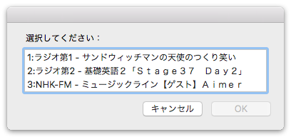

#rajiru2

##これは何？

[らじる らじる](http://www3.nhk.or.jp/netradio/)をWebブラウザなしで聴取するためのアプリです。

各番組のm3u8アドレスを調べて、アプリに同梱されているmpvバイナリに引き渡しているだけ。

##対応 OS

macOS 10.11.6(他のバージョンでも動くかもだけれど未検証。mpv次第) 

##スクリーンショット

##ダウンロード

Downloadをクリック → [Download](https://github.com/veadar/rajiru2/releases)

##参考にさせていただいたコード

- [mpv](https://mpv.io)
- [らじる らじるのXML](http://www3.nhk.or.jp/netradio/app/config_pc.xml)
- [指定URLのJSONをダウンロードしてRecordに変換 v2](http://piyocast.com/as/archives/3953)
- [plist handler.applescript](https://github.com/veadar/AppleScript/blob/master/plist%20handler.applescript)